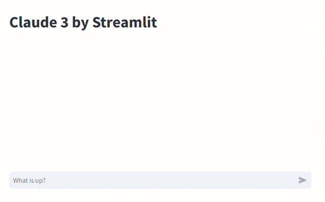

# Streamlit-claude-chat

Streamlit LLM Chat App by anthropic claude



## Git clone

```
git clone git@github.com:tkm5/streamlit-claude-chat.git
cd streamlit-claude-chat
```

## Environment setting

Write the Anthripic access key, the model to be used in the `.env` file.

```
API_KEY=XX-XXXXX...
AI_MODEL=claude-3-sonnet-20240229
```

## Execute

### Deploy on local

```bash
docker compose up -d
```

## Access
Please access the URL below.  
http://localhost:8501
